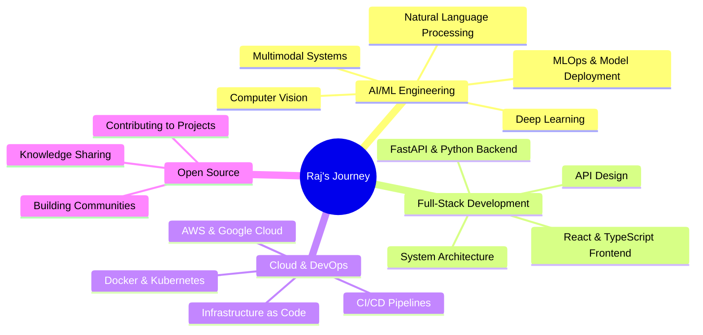

<div align="center">

# 👋 Hey there! I'm **Raj** (praj33)

### 🚀 AI Engineer | Full-Stack Developer | Multimodal Systems Architect

[](https://git.io/typing-svg)

</div>

---

## 🎯 **About Me**


```python
class Raj:
    def __init__(self):
        self.name = "Raj Prajapati"
        self.username = "praj33"
        self.location = "India 🇮🇳"
        self.role = "AI Engineer & Full-Stack Developer"
        self.current_focus = [
            "Multimodal AI Systems",
            "Enterprise-grade Applications", 
            "Cloud Architecture",
            "Open Source Contributions"
        ]
        self.learning = [
            "Advanced Deep Learning",
            "MLOps & Model Deployment",
            "Kubernetes & Cloud Native",
            "System Design at Scale"
        ]
        self.hobbies = [
            "Building AI Projects",
            "Contributing to Open Source",
            "Tech Blogging",
            "Mentoring Developers"
        ]
        
    def say_hi(self):
        print("Thanks for dropping by! Let's build something amazing together! 🚀")
    
    def get_daily_routine(self):
        return {
            "morning": "☕ Coffee + Code Review",
            "afternoon": "🚀 Building AI Systems", 
            "evening": "📚 Learning New Tech",
            "night": "🌙 Open Source Contributions"
        }

me = Raj()
me.say_hi()
```

🔭 **Currently Working On:** Enterprise-grade Multimodal Sentiment Analysis System  
🌱 **Learning:** Advanced AI architectures, MLOps, and Cloud-native development  
👯 **Looking to Collaborate:** AI/ML projects, Open source contributions  
💬 **Ask Me About:** Python, AI/ML, FastAPI, Docker, React, System Architecture  
⚡ **Fun Fact:** I love turning complex AI research into production-ready systems!

---

## 🛠️ **Tech Stack & Tools**

<div align="center">

### **Languages**


### **AI/ML & Data Science**


### **Web Development**


### **Databases**


### **DevOps & Cloud**


</div>

---

## 📊 **GitHub Analytics**

<div align="center">

<a href="https://github.com/praj33">
  
</a>
<a href="https://github.com/praj33">
  
</a>

</div>

<div align="center">

<a href="https://github.com/praj33">
  
</a>

</div>

---

## 🚀 **Featured Projects**

<div align="center">

### 🎯 **[Multimodal Sentiment Analysis System](https://github.com/praj33/multimodal-sentiment-classifier)**
*Enterprise-grade AI system for real-time sentiment analysis across text, audio, and video*

</div>

<table>
<tr>
<td width="50%">

**🔥 Key Features:**
- ⚡ Real-time multimodal processing
- 🎯 Team-specific configurations  
- 🚀 GPU acceleration support
- 📊 Advanced analytics dashboard
- 🔒 Enterprise security features

</td>
<td width="50%">

**🛠️ Tech Stack:**
- **Backend:** Python, FastAPI, TensorFlow
- **Frontend:** React, TypeScript
- **Infrastructure:** Docker, Kubernetes
- **Database:** PostgreSQL, Redis
- **Cloud:** AWS, Google Cloud

</td>
</tr>
</table>

**🎯 Use Cases:** Avatar emotion detection, AI teacher scoring, Content moderation, Customer feedback analysis  
**📈 Performance:** <100ms latency, 95%+ accuracy, Enterprise-ready scalability

---

## 📈 **Contribution Activity**

<div align="center">

<a href="https://github.com/praj33">
  
</a>

</div>

---

## 🎯 **Current Focus & Learning Path**

<div align="center">



</div>

---

## 🏆 **Achievements & Milestones**

<div align="center">

| 🎯 **Category** | 🚀 **Achievement** | 📊 **Status** |
|:---|:---|:---:|
| 🤖 **AI/ML** | Multimodal Sentiment Analysis System | ✅ **Completed** |
| 🌐 **Web Dev** | Full-Stack Enterprise Applications | ✅ **Completed** |
| ☁️ **Cloud** | AWS & GCP Certified Solutions | 🔄 **In Progress** |
| 📚 **Open Source** | Active Contributor & Maintainer | ✅ **Ongoing** |
| 🎓 **Learning** | Advanced System Design | 🔄 **In Progress** |

</div>

---

## 🤝 **Let's Connect & Collaborate!**

<div align="center">

[](https://linkedin.com/in/raj-prajapati)
[](https://twitter.com/raj_praj33)
[](mailto:raj.prajapati.dev@gmail.com)
[](https://raj-portfolio.dev)
[](https://discord.gg/raj-dev)

**💼 Open for:** Freelance Projects | Full-time Opportunities | Collaboration | Mentoring

</div>

---

## 💡 **Daily Inspiration**

<div align="center">


</div>

---

## 🐍 **Watch my contribution graph get eaten by the snake!**

<div align="center">

<picture>
    <source media="(prefers-color-scheme: dark)" srcset="https://raw.githubusercontent.com/praj33/praj33/output/github-contribution-grid-snake-dark.svg">
    <source media="(prefers-color-scheme: light)" srcset="https://raw.githubusercontent.com/praj33/praj33/output/github-contribution-grid-snake.svg">
    
</picture>

</div>

---

<div align="center">

### 🚀 **"The best way to predict the future is to create it."** - Peter Drucker

**Thanks for visiting my profile! ⭐ Star some repositories if you find them interesting!**


**Last Updated:** January 2025 | **Profile Views:** 

</div>
