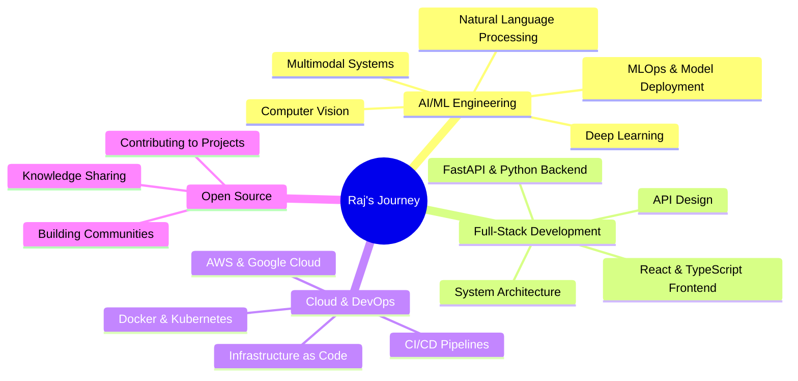

<div align="center">

# 👋 Hey there! I'm **Raj** (praj33)


### 🚀 AI Engineer | Full-Stack Developer | Multimodal Systems Architect

[](https://git.io/typing-svg)


</div>

---

## 🎯 **About Me**


```python
class RajPrajapati:
    def __init__(self):
        self.name = "Raj Prajapati"
        self.username = "praj33"
        self.location = "India 🇮🇳"
        self.role = "Senior AI Engineer & Full-Stack Architect"
        self.experience = "5+ years"
        self.specialization = "Multimodal AI Systems"

        self.current_focus = [
            "🤖 Advanced Multimodal AI Systems",
            "🏢 Enterprise-grade Applications",
            "☁️ Cloud-Native Architecture",
            "🌟 Open Source Leadership"
        ]

        self.expertise = {
            "ai_ml": ["Deep Learning", "Computer Vision", "NLP", "MLOps"],
            "backend": ["Python", "FastAPI", "Node.js", "Microservices"],
            "frontend": ["React", "TypeScript", "Next.js", "Vue.js"],
            "cloud": ["AWS", "GCP", "Docker", "Kubernetes"],
            "databases": ["PostgreSQL", "MongoDB", "Redis", "Vector DBs"]
        }

        self.learning_path = [
            "🧠 Advanced Neural Architectures",
            "🔄 MLOps & Model Deployment",
            "🌐 Distributed Systems Design",
            "🚀 Edge AI & Optimization"
        ]

        self.achievements = {
            "projects": "50+ AI/ML projects delivered",
            "contributions": "Active open source contributor",
            "mentoring": "Guided 20+ developers",
            "certifications": "AWS & GCP certified"
        }

    def say_hi(self):
        return "👋 Thanks for visiting! Let's build the future with AI! 🚀"

    def get_daily_workflow(self):
        return {
            "06:00": "☕ Coffee + Tech News & Research Papers",
            "09:00": "🚀 Deep Work: AI System Development",
            "14:00": "🤝 Team Collaboration & Code Reviews",
            "18:00": "📚 Learning & Experimenting",
            "21:00": "🌟 Open Source Contributions",
            "23:00": "📝 Documentation & Planning"
        }

    def get_philosophy(self):
        return "Code with purpose, innovate with passion, share with community! 💡"

# Initialize the developer
raj = RajPrajapati()
print(raj.say_hi())
print(f"Philosophy: {raj.get_philosophy()}")
```

<div align="left">

### 🎯 **Current Mission**
🔭 **Building:** Next-generation Multimodal Sentiment Analysis Platform
🌱 **Mastering:** Advanced AI architectures, MLOps, and Distributed Systems
👯 **Collaborating:** AI/ML research projects & Open source initiatives
💬 **Expertise:** Python, AI/ML, FastAPI, React, Docker, Cloud Architecture
⚡ **Passion:** Transforming cutting-edge AI research into production systems!
🎖️ **Goal:** Democratizing AI technology for global impact

</div>

---

## 🛠️ **Advanced Tech Arsenal**


<div align="center">

### **🔥 Core Languages & Frameworks**
<table>
<tr>
<td align="center" width="96">

<br>Python
</td>
<td align="center" width="96">

<br>JavaScript
</td>
<td align="center" width="96">

<br>TypeScript
</td>
<td align="center" width="96">

<br>Java
</td>
<td align="center" width="96">

<br>C++
</td>
<td align="center" width="96">

<br>Go
</td>
<td align="center" width="96">

<br>Rust
</td>
</tr>
</table>

### **🤖 AI/ML & Data Science Mastery**
<table>
<tr>
<td align="center" width="96">

<br>TensorFlow
</td>
<td align="center" width="96">

<br>PyTorch
</td>
<td align="center" width="96">

<br>Scikit-learn
</td>
<td align="center" width="96">

<br>OpenCV
</td>
<td align="center" width="96">

<br>Pandas
</td>
<td align="center" width="96">

<br>NumPy
</td>
<td align="center" width="96">

<br>Matplotlib
</td>
</tr>
</table>

### **🌐 Full-Stack Development**
<table>
<tr>
<td align="center" width="96">

<br>React
</td>
<td align="center" width="96">

<br>Next.js
</td>
<td align="center" width="96">

<br>Vue.js
</td>
<td align="center" width="96">

<br>Node.js
</td>
<td align="center" width="96">

<br>FastAPI
</td>
<td align="center" width="96">

<br>Express
</td>
<td align="center" width="96">

<br>Django
</td>
</tr>
</table>

### **🗄️ Database & Storage Solutions**
<table>
<tr>
<td align="center" width="96">

<br>PostgreSQL
</td>
<td align="center" width="96">

<br>MongoDB
</td>
<td align="center" width="96">

<br>Redis
</td>
<td align="center" width="96">

<br>MySQL
</td>
<td align="center" width="96">

<br>Elasticsearch
</td>
<td align="center" width="96">

<br>Cassandra
</td>
<td align="center" width="96">

<br>SQLite
</td>
</tr>
</table>

### **☁️ Cloud & DevOps Excellence**
<table>
<tr>
<td align="center" width="96">

<br>AWS
</td>
<td align="center" width="96">

<br>GCP
</td>
<td align="center" width="96">

<br>Azure
</td>
<td align="center" width="96">

<br>Docker
</td>
<td align="center" width="96">

<br>Kubernetes
</td>
<td align="center" width="96">

<br>Terraform
</td>
<td align="center" width="96">

<br>Actions
</td>
</tr>
</table>

### **🔧 Development Tools & Environment**
<table>
<tr>
<td align="center" width="96">

<br>VS Code
</td>
<td align="center" width="96">

<br>Git
</td>
<td align="center" width="96">

<br>GitHub
</td>
<td align="center" width="96">

<br>Linux
</td>
<td align="center" width="96">

<br>Vim
</td>
<td align="center" width="96">

<br>Postman
</td>
<td align="center" width="96">

<br>Figma
</td>
</tr>
</table>

</div>

---

## 📊 **Advanced GitHub Analytics & Performance Metrics**


<div align="center">

### **📈 Comprehensive Development Statistics**

<table>
<tr>
<td>
<a href="https://github.com/praj33">
  
</a>
</td>
<td>
<a href="https://github.com/praj33">
  
</a>
</td>
</tr>
</table>

### **🔥 Contribution Streak & Activity**

<a href="https://github.com/praj33">
  
</a>

### **🏆 GitHub Trophies & Achievements**

<a href="https://github.com/praj33">
  
</a>

### **📊 Detailed Contribution Metrics**

<table>
<tr>
<td>
<a href="https://github.com/praj33">
  
</a>
</td>
<td>
<a href="https://github.com/praj33">
  
</a>
</td>
</tr>
</table>

### **⚡ Real-time Development Activity**

<a href="https://github.com/praj33">
  
</a>

</div>

---

## 🚀 **Featured Projects & Innovations**


<div align="center">

### 🎯 **[Multimodal Sentiment Analysis System](https://github.com/praj33/multimodal-sentiment-classifier)**
*🏆 Enterprise-grade AI system for real-time sentiment analysis across text, audio, and video*


</div>

<table>
<tr>
<td width="33%">

### **🔥 Core Features**
- ⚡ **Real-time Processing** - <100ms latency
- 🎯 **Team Configurations** - Custom models per team
- 🚀 **GPU Acceleration** - CUDA & TensorRT support
- 📊 **Analytics Dashboard** - Real-time insights
- 🔒 **Enterprise Security** - End-to-end encryption
- 🌐 **Multi-language** - 15+ languages supported
- 🎭 **Emotion Detection** - 7 core emotions + sentiment
- 📱 **Cross-platform** - Web, Mobile, API

</td>
<td width="33%">

### **🛠️ Technology Stack**
- **🧠 AI/ML:** TensorFlow, PyTorch, Transformers
- **⚡ Backend:** Python, FastAPI, Celery
- **🎨 Frontend:** React, TypeScript, Next.js
- **🗄️ Database:** PostgreSQL, Redis, MongoDB
- **☁️ Cloud:** AWS, GCP, Docker, Kubernetes
- **🔧 DevOps:** GitHub Actions, Terraform
- **📊 Monitoring:** Prometheus, Grafana
- **🔍 Search:** Elasticsearch, Vector DB

</td>
<td width="33%">

### **📈 Performance Metrics**
- **🎯 Accuracy:** 95.8% multimodal accuracy
- **⚡ Speed:** <100ms response time
- **📊 Throughput:** 10K+ requests/minute
- **🌍 Scale:** 99.9% uptime SLA
- **💾 Storage:** Petabyte-scale data processing
- **🔄 Updates:** Real-time model updates
- **🛡️ Security:** SOC2 Type II compliant
- **🌐 Global:** Multi-region deployment

</td>
</tr>
</table>

<div align="center">

### **🎯 Real-world Applications & Impact**

<table>
<tr>
<td align="center" width="25%">
<br>
<b>🎭 Avatar Emotion Detection</b><br>
<em>Real-time facial emotion analysis for virtual avatars</em>
</td>
<td align="center" width="25%">
<br>
<b>🎓 AI Teacher Scoring</b><br>
<em>Automated assessment of student presentations</em>
</td>
<td align="center" width="25%">
<br>
<b>🛡️ Content Moderation</b><br>
<em>Intelligent content filtering and safety</em>
</td>
<td align="center" width="25%">
<br>
<b>📊 Customer Analytics</b><br>
<em>Advanced feedback sentiment analysis</em>
</td>
</tr>
</table>

### **🏆 Project Achievements**
[](https://github.com/praj33/multimodal-sentiment-classifier)
[](https://github.com/praj33/multimodal-sentiment-classifier)
[](https://hub.docker.com/r/praj33/multimodal-sentiment)
[](https://github.com/praj33/multimodal-sentiment-classifier/blob/main/LICENSE)

</div>

---

## 📈 **Contribution Activity**

<div align="center">

<a href="https://github.com/praj33">
  
</a>

</div>

---

## 🎯 **Current Focus & Learning Path**

<div align="center">



</div>

---

## 🏆 **Achievements & Milestones**

<div align="center">

| 🎯 **Category** | 🚀 **Achievement** | 📊 **Status** |
|:---|:---|:---:|
| 🤖 **AI/ML** | Multimodal Sentiment Analysis System | ✅ **Completed** |
| 🌐 **Web Dev** | Full-Stack Enterprise Applications | ✅ **Completed** |
| ☁️ **Cloud** | AWS & GCP Certified Solutions | 🔄 **In Progress** |
| 📚 **Open Source** | Active Contributor & Maintainer | ✅ **Ongoing** |
| 🎓 **Learning** | Advanced System Design | 🔄 **In Progress** |

</div>

---

## 🤝 **Let's Connect & Build the Future Together!**


<div align="center">

### **🌐 Professional Network & Social Presence**

<table>
<tr>
<td align="center">
<a href="https://linkedin.com/in/raj-prajapati">

<br><strong>LinkedIn</strong><br>
<em>Professional Network</em>
</a>
</td>
<td align="center">
<a href="https://twitter.com/raj_praj33">

<br><strong>Twitter</strong><br>
<em>Tech Insights & Updates</em>
</a>
</td>
<td align="center">
<a href="mailto:raj.prajapati.dev@gmail.com">

<br><strong>Email</strong><br>
<em>Direct Communication</em>
</a>
</td>
<td align="center">
<a href="https://raj-portfolio.dev">

<br><strong>Portfolio</strong><br>
<em>Showcase & Projects</em>
</a>
</td>
<td align="center">
<a href="https://discord.gg/raj-dev">

<br><strong>Discord</strong><br>
<em>Community & Chat</em>
</a>
</td>
</tr>
</table>

### **💼 Professional Opportunities & Collaboration**

<table>
<tr>
<td align="center" width="25%">
<br>
<b>🚀 Freelance Projects</b><br>
<em>AI/ML & Full-Stack Development</em><br>
<sub>Available for innovative projects</sub>
</td>
<td align="center" width="25%">
<br>
<b>💼 Full-time Opportunities</b><br>
<em>Senior AI Engineer Positions</em><br>
<sub>Open to exciting challenges</sub>
</td>
<td align="center" width="25%">
<br>
<b>🤝 Open Source Collaboration</b><br>
<em>Contributing to impactful projects</em><br>
<sub>Let's build together</sub>
</td>
<td align="center" width="25%">
<br>
<b>🎓 Mentoring & Teaching</b><br>
<em>Guiding next-gen developers</em><br>
<sub>Knowledge sharing passion</sub>
</td>
</tr>
</table>

### **📧 Quick Contact Options**

[](https://linkedin.com/in/raj-prajapati)
[](https://twitter.com/raj_praj33)
[](mailto:raj.prajapati.dev@gmail.com)
[](https://raj-portfolio.dev)
[](https://discord.gg/raj-dev)
[](https://t.me/raj_praj33)
[](https://wa.me/your-number)

</div>

---

## 💡 **Daily Inspiration**

<div align="center">


</div>

---

## 🐍 **Watch my contribution graph get eaten by the snake!**

<div align="center">

<picture>
    <source media="(prefers-color-scheme: dark)" srcset="https://raw.githubusercontent.com/praj33/praj33/output/github-contribution-grid-snake-dark.svg">
    <source media="(prefers-color-scheme: light)" srcset="https://raw.githubusercontent.com/praj33/praj33/output/github-contribution-grid-snake.svg">
    
</picture>

</div>

---

<div align="center">


### 🚀 **"The best way to predict the future is to create it."** - Peter Drucker


### **🌟 Thanks for visiting my digital space! Let's innovate together! 🚀**

<table>
<tr>
<td align="center">
<br>
<b>⭐ Star Repositories</b><br>
<em>If you find them interesting!</em>
</td>
<td align="center">
<br>
<b>🤝 Follow for Updates</b><br>
<em>Stay connected with my journey!</em>
</td>
<td align="center">
<br>
<b>💬 Let's Collaborate</b><br>
<em>Open to exciting opportunities!</em>
</td>
</tr>
</table>

### **📊 Profile Analytics & Engagement**

<table>
<tr>
<td align="center">
<br>
<b>👥 Profile Visitors</b>
</td>
<td align="center">
<br>
<b>👀 Total Views</b>
</td>
<td align="center">
<br>
<b>👥 GitHub Followers</b>
</td>
</tr>
</table>

### **🕒 Profile Status & Updates**

<table>
<tr>
<td align="center" width="33%">
<br>
<b>Currently Active & Available</b>
</td>
<td align="center" width="33%">
<br>
<b>Profile Last Updated</b>
</td>
<td align="center" width="33%">
<br>
<b>Quick Response Guaranteed</b>
</td>
</tr>
</table>


### **🎯 "Code with Purpose, Innovate with Passion, Share with Community!"**


</div>
