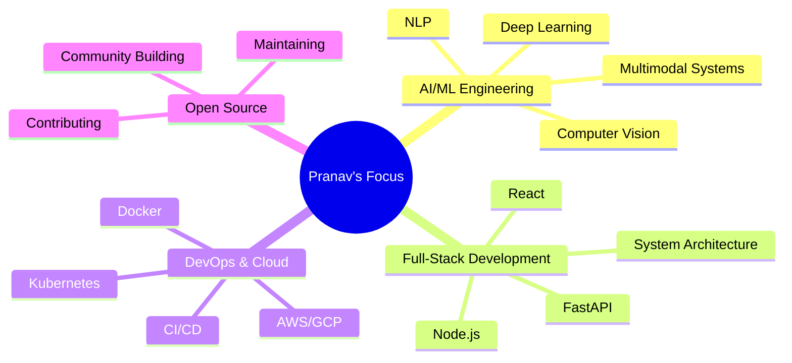

<div align="center">

# 👋 Hey there! I'm Pranav (praj33)

### 🚀 AI Engineer | Full-Stack Developer | Multimodal Systems Architect

[](https://git.io/typing-svg)

</div>

---

## 🎯 **About Me**

```python
class Pranav:
    def __init__(self):
        self.name = "Pranav"
        self.username = "praj33"
        self.location = "India 🇮🇳"
        self.current_focus = ["AI/ML", "Multimodal Systems", "Full-Stack Development"]
        self.learning = ["Advanced Deep Learning", "MLOps", "Cloud Architecture"]
        
    def say_hi(self):
        print("Thanks for dropping by! Let's build something amazing together! 🚀")

me = Pranav()
me.say_hi()
```

🔭 **Currently Working On:** Enterprise-grade Multimodal Sentiment Analysis System  
🌱 **Learning:** Advanced AI architectures, MLOps, and Cloud-native development  
👯 **Looking to Collaborate:** AI/ML projects, Open source contributions  
💬 **Ask Me About:** Python, AI/ML, FastAPI, Docker, React, System Architecture  
⚡ **Fun Fact:** I love turning complex AI research into production-ready systems!

---

## 🛠️ **Tech Stack & Tools**

### **Languages**


### **AI/ML & Data Science**


### **Web Development**


### **Databases**


### **DevOps & Cloud**


---

## 📊 **GitHub Analytics**

<div align="center">
  
  
</div>

<div align="center">
  
</div>

---

## 🏆 **Featured Projects**

### 🎭 [Multimodal Sentiment Analysis System](https://github.com/praj33/multimodal-sentiment-classifier)
> **Enterprise-grade AI system for real-time sentiment analysis across text, audio, and video**
- 🔥 **Tech Stack:** Python, FastAPI, TensorFlow, Docker, Kubernetes
- ⚡ **Features:** Real-time processing, GPU acceleration, team-specific configurations
- 🎯 **Use Cases:** Avatar emotions, AI teacher scoring, content moderation
- 📈 **Performance:** <100ms latency, 95%+ accuracy, enterprise-ready

### 🚀 [Project Name 2] (Coming Soon)
> **Brief description of your second major project**
- 🛠️ **Tech Stack:** Technologies used
- ✨ **Key Features:** Main features
- 🎯 **Impact:** Results achieved

### 🌟 [Project Name 3] (Coming Soon)
> **Brief description of your third major project**
- 🛠️ **Tech Stack:** Technologies used
- ✨ **Key Features:** Main features
- 🎯 **Impact:** Results achieved

---

## 📈 **Contribution Graph**

<div align="center">
  
</div>

---

## 🎯 **Current Focus Areas**



---

## 🏅 **Achievements & Certifications**

- 🎓 **AI/ML Specialization** - [Institution/Platform]
- 🏆 **Cloud Architecture Certification** - [Provider]
- 🥇 **Open Source Contributor** - Multiple projects
- 📜 **Full-Stack Development** - [Certification]

---

## 📫 **Let's Connect!**

<div align="center">

[](https://linkedin.com/in/your-profile)
[](https://twitter.com/your-handle)
[](mailto:your.email@example.com)
[](https://your-portfolio.com)
[](https://discord.gg/your-server)

</div>

---

## 💡 **Random Dev Quote**

<div align="center">


</div>

---

## 🐍 **Watch my contribution graph get eaten by the snake!**

<div align="center">
  


</div>

---

<div align="center">

### 🚀 **"Code is like humor. When you have to explain it, it's bad."** - Cory House

**Thanks for visiting! ⭐ Star some repositories if you find them interesting!**


</div>

---

## 🔧 **Profile Setup Instructions**

### **Step 1: Create Your Profile Repository**
1. Go to GitHub and create a new repository named `praj33` (same as your username)
2. Make it public and initialize with a README
3. Clone this repository and replace the README.md with the content above

### **Step 2: Customize Your Profile**
- Update the social media links in the "Let's Connect" section
- Add your real email, LinkedIn, Twitter, etc.
- Update the achievements and certifications section
- Add your actual projects in the "Featured Projects" section

### **Step 3: Enable GitHub Actions**
- The snake animation will automatically generate once you push the `.github/workflows/snake.yml` file
- Make sure GitHub Actions are enabled in your repository settings

### **Step 4: Update Regularly**
- Keep your projects section updated
- Add new skills and technologies as you learn them
- Update your current focus areas

**🎯 Pro Tip:** This profile will automatically update with your GitHub stats and contribution graph!
